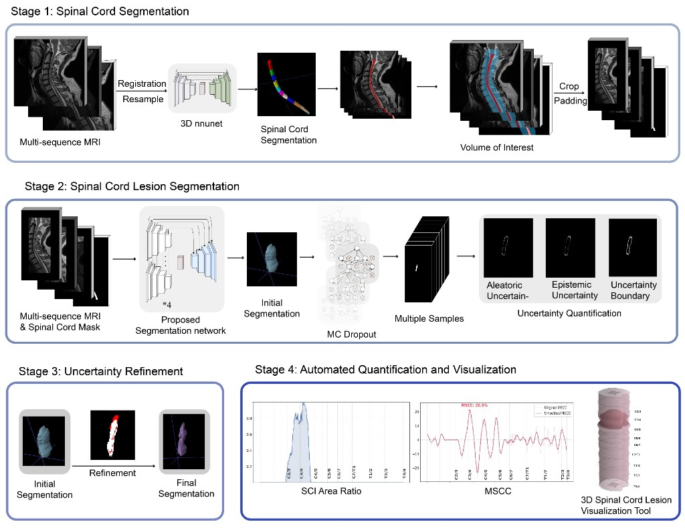
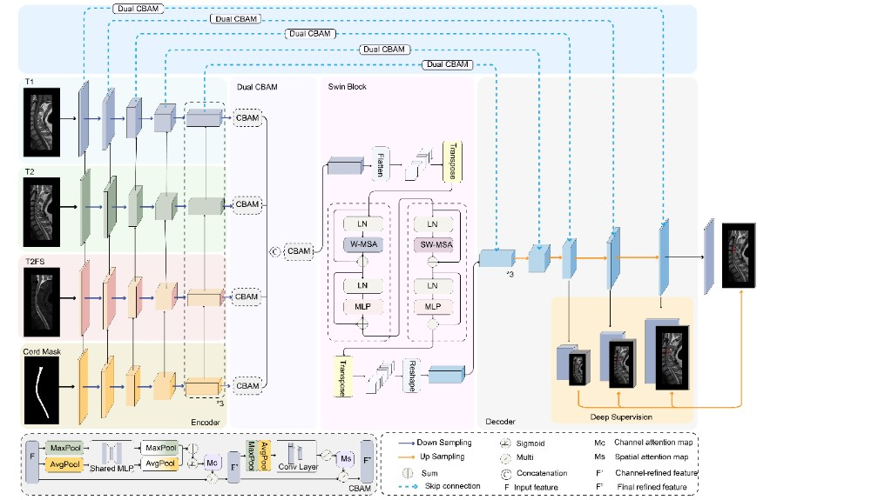
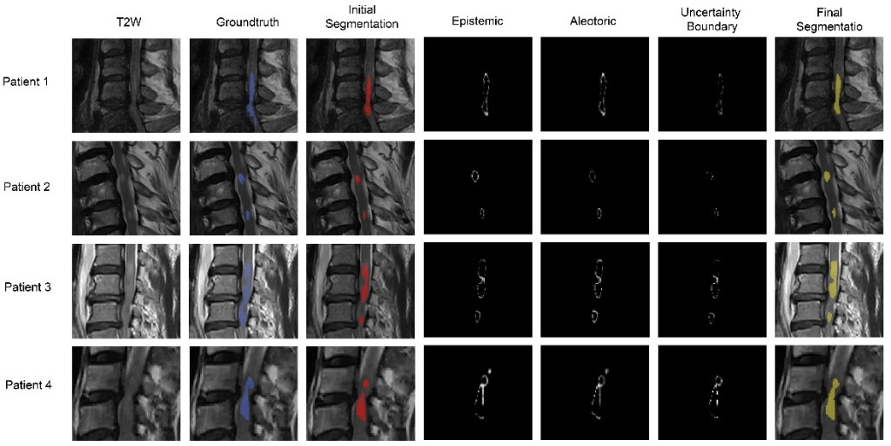
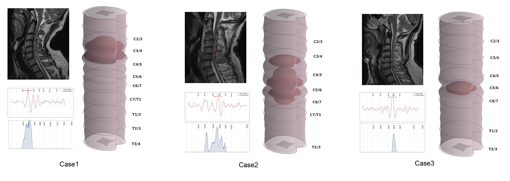

# An Automated Multi-sequence MRI Framework for Quantitative Assessment and 3D Visualization of Acute Cervical Spinal Cord Injury


Precise evaluation of spinal cord compression and intramedullary lesions is essential for surgical decision-making in spinal cord injury (SCI). However, traditional clinical evaluation is intrinsically subjective, frequently challenged by small lesion volumes, elongated morphology, and ambiguous boundaries, leading to high inter-rater variability.

This repository provides an **uncertainty-aware** deep learning pipeline designed to advance SCI evaluation from subjective visual assessment to standardized, quantitative outcome monitoring.

> Note: Training imaging data is not included in this repository. Please prepare NIfTI files and JSON split files as described in the documentation.

## Key Features

### 1) Robust Lesion Segmentation

At its core, the framework features a fully automated, multi-modal neural network designed specifically to handle the complex, elongated, and irregular morphology of intramedullary lesions. At the foundational algorithmic level, the architecture integrates several advanced modules to maximize segmentation accuracy:

* **Deep Supervision (DS):** Strategically employed to preserve fine-grained lesion features that are frequently attenuated during network downsampling.
* **Swin Bottleneck (SB) & Dual CBAM (DCBAM):** Integrated to enrich feature representations and effectively capture long-range spatial dependencies across the spinal cord.

Together, these algorithmic enhancements resolve the inherent challenges of spinal cord imaging, providing a highly reliable and accurate foundation for all downstream clinical quantification.

### 2) Uncertainty-Aware Boundary Refinement

To address the inherent spatial ambiguity of lesion boundaries, we integrate Monte Carlo (MC) dropout during inference.  
Instead of forcing the model to output a single rigid boundary, this module produces a predictive distribution of segmentation maps, quantifies diagnostic uncertainty, and refines lesion boundaries toward generalized multi-expert consensus.

### 3) Anatomically Anchored 3D Visualization Tool

The pipeline directly converts raw predictions into an intuitive, anatomically anchored 3D representation and automatically:

- **Generates a comprehensive longitudinal profile** of spinal cord compression severity and lesion burden across the entire spinal cord.
- **Maps pathological features and clinical metrics** to exact vertebral levels, providing precise anatomical orientation for the entire cord's extent.


## Documentation and Method Figures

- **[Dataset format and JSON specification](docs/DATASET.md)**: data directory structure, field definitions for `train.json` / `val.json` / `test.json`, and path resolution rules.
- **[Method description and figures](docs/method.md)**: framework overview, model architecture, and uncertainty-aware boundary visualization.

### Framework


### Model Architecture


### Uncertainty Boundary


## Environment Setup

- Python 3.10+ (`environment.yml` is pinned to 3.10)
- Create the environment:

```bash
conda env create -f environment.yml
conda activate sci
```

### Install PyTorch (CUDA Required)

The project is designed for GPU training. Since `pip install -r requirements.txt` may install a CPU-only build of PyTorch, we recommend installing the CUDA build first, then the remaining dependencies:

```bash
# Example: CUDA 12.4
pip uninstall -y torch torchvision torchaudio
pip install torch torchvision torchaudio --index-url https://download.pytorch.org/whl/cu124
pip install -r requirements.txt
```

Verify PyTorch and CUDA:

```bash
python -c "import torch; print('torch:', torch.__version__); print('cuda available:', torch.cuda.is_available()); print('torch cuda:', torch.version.cuda)"
```

## Quick Start

```bash
# Training (prepare data and paths first; see docs/DATASET.md)
python train_lesion_unet.py --config configs/multimodal_lesion_unet.yaml

# Testing / evaluation
python test_lesion_unet.py --config configs/multimodal_lesion_unet.yaml --checkpoint <path/to/best_*.pt>

# Resume training
python resume_training.py --checkpoint <path/to/weights/*.pt>
# Or automatically pick the latest weight under experiments/*/weights
python resume_training.py --auto
```

## Inference Uncertainty Module (`inference/`, optional)

- `inference/uncertainty.py`: MC dropout and epistemic uncertainty boundary utilities (not directly invoked by the default training loop).
- `tools/generate_uncertainty_boundaries.py`: loads a checkpoint and calls `inference.uncertainty` to generate NIfTI outputs under `output_dir/<split>/uncertainty_boundaries/`, which can be used as an optional input channel: `uncertainty_boundary`.

## Data Utilities (`tools/`)

- `tools/create_spinal_cord_dataset.py`: example script for raw multicenter data scenarios; for production usage, follow `docs/DATASET.md` and `data/dataloader.py`.
- `tools/analyze_dataset.py`: analyzes NIfTI spacing, shape, and intensity distributions to validate configuration choices such as `spatial_size` and `target_spacing`.

## Analysis and Visualization

- `3d_sci_visualization_tool/`: post-processing scripts for SCI/MSCC quantification and 3D rendering used in the paper workflow.
- Detailed I/O definitions and example commands: `docs/3d_visualization_of_acute_cervical_spinal_cord_injury.md`
- Common scripts: `compute_sci_biomarkers.py`, `compute_mscc_biomarkers.py`, `render_spine_biomarker_3d.py`


=======
### 3D VISUALIZATION CASE

>>>>>>> 08f8ef9 (Update README and add 3D visualization case figure)

## Configuration

- Main config: `configs/multimodal_lesion_unet.yaml`
- Model type: `model.type: multimodal_lesion_unet`

=======
## License

This project is licensed under the MIT License. See the `LICENSE` file for details.
>>>>>>> 08f8ef9 (Update README and add 3D visualization case figure)
